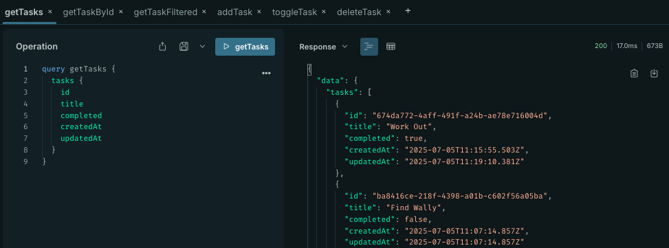

# lush_coding_assignment

## Objective
Build a basic GraphQL API server using NodeJS, TypeScript, Apollo Server, Prisma, and Pothos GraphQL to manage a simple list of tasks. This assignment aims to evaluate your understanding of GraphQL principles, schema design with Pothos, TypeScript usage, and general backend development practices.

## Getting Started/Code Installation
Clone repository onto your machine and follow these steps:

1. In CLI run `npm i` on the root level to install dependencies.
2. Then run the command `npm run dev` to run program in your local environment.
3. Server ready at http://localhost:4000/

### Dependencies
* apollo-server (Apollo Server)
* pothos/core (Core schema builder)
* pothos/plugin-prisma (Prisma integration)
* prisma/client (Prisma db client)
* prisma/extension-accelerate (Performance optimization)
* graphql (GraphQL JS implementation)
* graphql-scalars (Custom scalars)
* Zod (Validate Queries)


### Technologies Used
* NodeJS
* TypeScript
* GraphQL
* Visual Studio Code
* Apollo Server
* Git/GitHub
* Pothos (GraphQL Schema Builder)
* Prisma

## Installation
Created Git Repo with a `README` file

Initialized NodeJS with `package.json`:
```
npm init 
```

Installed TypeScript and created a `tsconfig.json` file:
```
npm install --save-dev typescript @types/node
npx tsc --init
```

## Prisma
Installed Prisma:
``` 
npx prisma@latest init --db 
```

Following this command, Prisma created an initial `schema.prisma` file and a `.env` file 
with a `DATABASE_URL` environment variable already set.

Installed Prisma VS Code Extension.


In `schema.prisma` I added `SQLite` as a provider for simplicity as per *Note* in assignment instructions:
```js
datasource db {
  provider = "sqlite"
  url      = env("DATABASE_URL")  //Automatically created and stored in .env
}
```
Also changed the `DATABASE_URL` path to reflect this:

```js
DATABASE_URL="file:./dev.db"
```

Created a Prisma Schema:
```js
model Task {
  id         String   @id @default(uuid())       // Prisma's built-in UUID 
  title      String                             
  completed  Boolean  @default(false)            // Defaults to false
  createdAt  DateTime @default(now())            // Auto-generated timestamp
  updatedAt  DateTime @updatedAt                 // Auto-updates on every change
}
```

Created `.gitignore` file and added the following:
```
node_modules
/src/generated/prisma
.env
```

Added boilerplate code taken from `Prisma /docs` in `src/index.ts`to send queries with Prisma ORM:
```js
import { PrismaClient } from '../src/generated/prisma'
import { withAccelerate } from '@prisma/extension-accelerate'

const prisma = new PrismaClient().$extends(withAccelerate())

async function main() {

  const task = await prisma.task.create({
    data: {
      id: "eqiofjeoqfjeioq",
      title: 'Save Planet',
      completed: false,
    },
  })
  console.log(task)
}

main()
  .then(async () => {
    await prisma.$disconnect()
  })
  .catch(async (e) => {
    console.error(e)
    await prisma.$disconnect()
    process.exit(1)
  })
```

Ran the commands below to test:
```
npx prisma migrate dev --name init
npx prisma generate
npx tsx src/index.ts   
```

## GraphQL & Apollo
As I was not familiar with Pothos I decided to first get GraphQL and Apollo working together.
I have left the GraphQL files in `src/graphql` however they are currently unused.

Installed Apollo Server and GraphQL:
```
npm install @apollo/server graphql
```

Also installed Prisma Client in order to communicate with the database:
```
npm install prisma-client
@pothos/plugin-prisma 
```


Created a `src/server.ts` file and added code below to connect the Apollo Server:
```js
// APOLLO SERVER
const server = new ApolloServer({
  typeDefs,
  resolvers
});

async function start() {
  const { url } = await startStandaloneServer(server, {
    listen: { port: 4000 }
  });
  console.log(`🚀 Server ready at ${url}`);
}

start();
```

Created `src/graphql/schema.ts` and `resolvers.ts` files with my first 
*query* which was to return a list of all tasks:

```js
// THE SCHEMA or typeDefs TO DEFINE THE SHAPE OF THE DATA
export const typeDefs = gql`
  type Task {
    id: String!
    title: String!
    completed: Boolean!
    createdAt: String!
    updatedAt: String!
  }
```

```js
// THE FUNCTION WHICH RETURNS A LIST OF ALL TASKS
// NOTE THAT I AM USING PRISMA-CLIENT TO FETCH THE DATA FROM THE DATABASE
import { PrismaClient } from '../generated/prisma';

export const resolvers = {
  Query: {
    tasks: async (_: any, args: { search?: string }) => {
      const { search } = args;
      return prisma.task.findMany({
        where: search
          ? {
              title: {
                contains: search
              }
            }
          : undefined,
        orderBy: {
          createdAt: 'desc'
        }
      });
    },
  }
}
```

I then added all other *Queries/Mutations* and tested them on the Apollo Server (browser):




Once happy, I moved to migrating to Pothos.

## Pothos

Read documentation on Pothos to understand what the project structure should look like.

Installed Pothos:
```js
npm install --save @pothos/core 
```

Created `src/builder.ts` file to set up the schema builder:

```js
export const builder = new SchemaBuilder<{
  PrismaTypes: PrismaTypesFromClient<typeof prisma>;
  Context: { prisma: PrismaClient };
}>({
  plugins: [PrismaPlugin],
  prisma: {
    client: prisma,
  },
});
```

Created `src/schema/models/task.ts` to match the `prisma.schema` file:

```js
import { builder } from './builder';

builder.prismaObject('Task', {
  fields: (t: any) => ({
    id: t.exposeID('id'),
    title: t.exposeString('title'),
    completed: t.exposeBoolean('completed'),
    createdAt: t.expose('createdAt', { type: 'DateTime' }),
    updatedAt: t.expose('updatedAt', { type: 'DateTime' }),
  }),
});
```
Then created `src/schema/query.ts` file with my first query to return a list
of all tasks:

```js
builder.queryType({
  fields: (t) => ({

    tasks: t.prismaField({
      type: ['Task'],
      args: {
        search: t.arg.string(),
      },
      resolve: (query, _parent, args, context) => {
        return context.prisma.task.findMany({
          where: args.search
            ? { title: { contains: args.search } }
            : undefined,
          orderBy: { createdAt: 'desc' },
          ...query,
        });
      },
    }),
  }),
});
```

Ensured model definition, query and mutation files are imported in `src/server.ts`:

```js
import './schema/models/task'; //MODEL DEFINITION
import './schema/query' // FILE CONTAINING QUERIES
import './schema/mutation' // FILE CONTAINING MUTATIONS
```

As I had previously made all the **Queries and Mutations** on the Apollo Server with GraphQL, adding and testing each with Pothos was straight forward.

Please see below the list of queries and mutations:
```gql
query getTasks {
  # Returns a list of all tasks
  tasks {
    id
    title
    completed
    createdAt
    updatedAt
  }
}
query getTaskById {
  # Returns "null" if not found
  task (id: "05e76901-cb3a-4902-9260-f1d5e1bb4cfa") {
    id
    title
    completed
    createdAt
    updatedAt
  }
}
query getTaskFiltered {
  # Include an optional search argument (search: String)
  # Returns a list of all tasks matching the string => "Go to the gym"
  tasks(search: "Go") {
    id
    title
    completed
  }
}
mutation addTask {
  # Creates a new task with the given title and assigns a unique ID
  # Sets "completed" to false by default
  # Returns the newly created task.
  addTask(title: "Go to the gym") {
    id
    title
    completed
    createdAt
  }
}
mutation toggleTask {
  # "Go to the gym" is now set to "completed: true"
  # Updates the updatedAt timestamp
  # Returns the updated task or "null" if not found.
  toggleTask(
    id: "674da772-4aff-491f-a24b-ae78e716004d"
    title: "Go to the gym"
    completed: true
  ) {
    id
    title
    completed
    updatedAt
  }
}
mutation deleteTask{
  # Deletes a task by its ID.
  # Returns the deleted task or "null" if not found.
  deleteTask(id: "21abd6cc-597c-45f7-bfed-baab266da9fd") {
    title
    id
    completed
  }
}
```

Note: As GraphQL doesn’t have a built-in DateTime scalar type TypeScript was throwing an error,
I had to install `graphql-scalars` and add these lines to the `builder.ts` file:

```js
export const builder = new SchemaBuilder<{
  Scalars: {
    DateTime: {
      Input: Date;
      Output: Date;
    };
  };
  builder.addScalarType('DateTime', DateTimeResolver, {});
  ```

## Zod Validation

Installed Zod:
```js
npm install zod
```
### Adding validation to a Query or Mutation in 3 steps.

1. Created a file `src/validation/task.ts` and added the below code:

```js
import { z } from 'zod';

export const getTasksSchema = z.object({
  search: z
  .string()
  //In this example, Zod will validate the user input only
  //if no special characters are used in the search
  .regex(/^[a-zA-Z0-9\s]*$/, "No special characters allowed")
  .optional()
});
```
2. Created a middleware to handle the error in `src/middleware/zodValidate.ts`:
```js
import { ZodSchema } from 'zod';

export function validateArgs<T>(schema: ZodSchema<T>, args: unknown): T {
  const result = schema.safeParse(args);
  if (!result.success) {
    throw new Error(result.error.issues.map(i => i.message).join(', '));
  }
  return result.data;
}
```

3. Added the below code to the existing query *getTasks* in `src/schema/query.ts`:
```js
   resolve: async (query, _parent, args, context) => {
    // Validating input with Zod through a middleware
    // In this case: "No special characters allowed"
        const validatedArgs = validateArgs(getTasksSchema, args);
        return context.prisma.task.findMany({
          where: validatedArgs.search
            ? { title: { contains: validatedArgs.search } }
            : undefined,
          orderBy: { createdAt: 'desc' },
          ...query
        });
      }
```
Added other types of validation for each Query/Mutation and tested on Apollo Server.


# Bonus Points:
1. Complex error scenarios.

2. Add any additional queries or mutations you feel would enhance the project (no more than 2).

  ## Challenges
* Relationships between Prisma/Pothos/Apollo were challenging to grasp at first.
* Pothos was totally new and required some time to get used to.

## Wins
* Creating Prisma database 
* Connecting Apollo with GraphQL.
* Migrating was straight forward as when I encountered errors, I knew this was coming
from Pothos.

## Key Learning/Takeaways
* GraphQL Queries and Mutations.
* Creating the database with Prisma was enjoyable.
* Pothos was totally new but the documentation was very clear which helped a lot.

## Future Improvements
* 

## THANKS FOR READING!